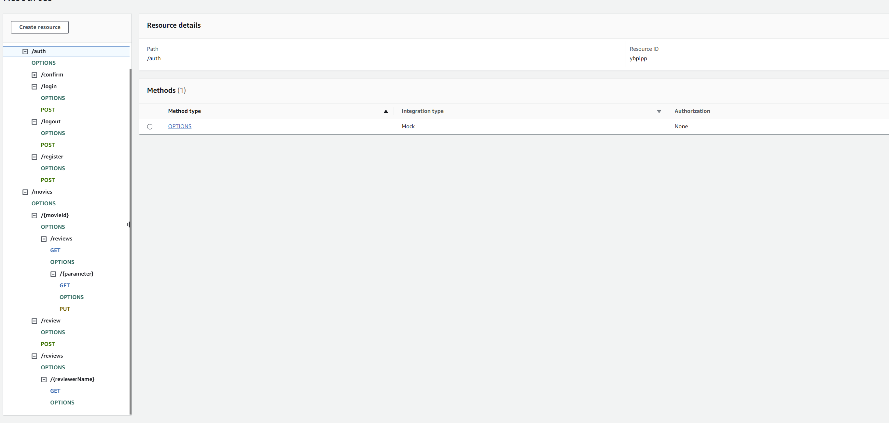

## ServerlessREST Assignment - Distributed Systems.

__Name:__ Darren Sills

This repository contains the implementation of a serverless REST API for the AWS platform. A CDK stack creates the infrastructure. The domain context of the API is movie reviews.

### API endpoints
 
+ **POST /movies/reviews** - Add a movie review.
+ **GET /movies/{movieId}/reviews** - Get all the reviews for a movie with the specified ID.
+ **GET /movies/{movieId}/reviews?minRating=n** - Get all the reviews for the movie with the specified ID with a rating greater or equal to the minRating.
+ **GET /movies/{movieId}/reviews/{parameter}** - Get the review for the movie with the specified movie ID and parameter, parameter can be specified year or reviewer name.
+ **GET /movies/{movieId}/reviews/{parameter}?language=code** - Get a translated version of the review for the movie with the specified movie ID and parameter, parameter can be specified year or reviewer name.
+ **PUT /movies/{movieId}/reviews/{reviewerName}** - Update the text of a review. (Movie ID and reviewer username uniquely identify a review item).
+ **GET /movies/reviews/{reviewerName}** - Get all the reviews written by a specific reviewer.

### Authentication

### Independent learning

+ **Multiple Stacks with Dependencies**: Implemented interconnected CDK stacks, managing dependencies between resources across stacks.
+ **Amazon Translate Integration**: Integrated the Amazon Translate service for real-time translation of movie reviews.
+ **Advanced DynamoDB Querying**: Utilized complex querying techniques with DynamoDB to efficiently retrieve data based on various parameters.
+ **Custom Lambda Roles**: Crafted specific IAM roles for Lambda functions, to automate AWS policy roles.

